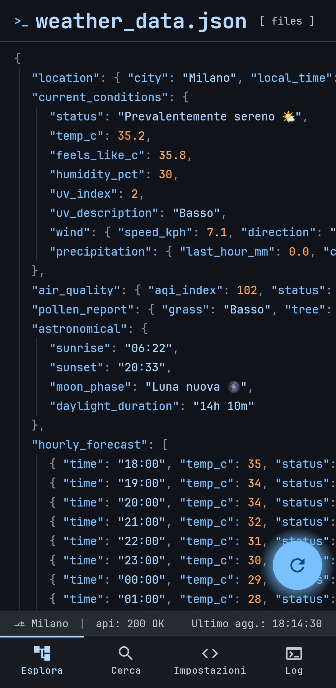
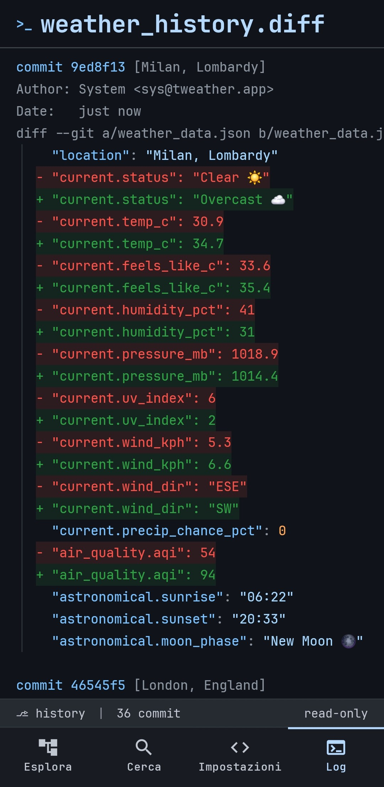
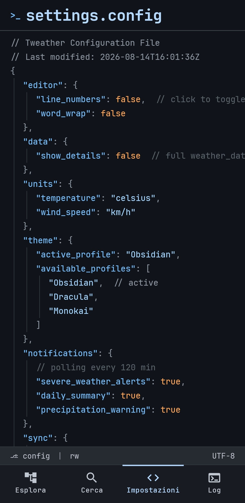

# tweather

[](https://github.com/fiorenzobrioni/tweather/actions/workflows/android-ci.yml)


**A weather app that thinks it is a code editor.**

Every screen is a file. The forecast is syntax-highlighted JSON with a line-number
gutter, settings are a `.config` you edit by tapping values, and the update history is
a git diff — hash, author, `+`/`-` lines and all. Checkboxes are `[x]`, the search box
is a shell prompt, and the weather icons are the emoji sitting inside the JSON.

It is a real weather app underneath: live data, background alerts, a home-screen
widget. The editor is the interface, not a skin over a list of cards.

| `weather_data.json` | `weather_history.diff` | `settings.config` |
|:---:|:---:|:---:|
|  |  |  |

---

## The idea

The bottom bar has four tabs, and each one opens a file rather than a screen.

### `weather_data.json` — the forecast

Tap the FAB to re-run the request. The `//` comments are the loading and error
channel, so a failure reads like a compiler message instead of a toast.

```json
{
  "location": {
    "city": "Milano",
    "local_time": "2026-08-14 17:57"
  },
  "current_conditions": {
    "status": "Sereno ☀️",
    "temp_c": 34.0,
    "feels_like_c": 35.0,
    "humidity_pct": 34,
    "uv_index": 7,
    "wind": { "speed_kph": 8.3, "direction": "NE" }
  },
  "air_quality": { "aqi_index": 42, "status": "Good ⚪" },
  "astronomical": { "sunrise": "06:12", "sunset": "20:35", "moon_phase": "Waxing Gibbous 🌔" }
}
```

Switch to Fahrenheit and the **keys change too** — `temp_f`, `speed_mph`. A JSON file
should not lie about its units.

### `weather_history.diff` — the update log

Every fetch is committed. The diff is computed between consecutive snapshots of the
same city, so you can see exactly what moved and when.

```diff
commit a3f9c21  [Milano]
Author: sys@tweather.app
Date:   2 hours ago

--- a/weather_data.json
+++ b/weather_data.json
   "current_conditions": {
-    "temp_c": 32.1,
+    "temp_c": 34.0,
-    "humidity_pct": 41,
+    "humidity_pct": 34,
   }
```

### `search_query.json` — the search

The input field *is* the `"search_term"` value, quotes included, with a blinking
underscore for a cursor. Recent searches are a JSON array you can tap to re-run, and
`$ history -c` clears them — the shell's own verb, and deliberately narrow: it forgets
what you searched for and never touches the cities you saved.

### `settings.config` — the settings

Booleans flip on tap, strings and numbers cycle, and the trailing hint tells you the
allowed values. Resetting is a command with a two-tap confirm:
`$ git restore settings.config`.

---

## The widget

A terminal window on the home screen. It re-lays itself out as you resize: from a
glanceable strip up to the full transcript, one extra reading per line of room.


```console
sys@tweather:~$ get weather -current
  Location: "Milano"
  Temp: 34°C
  Feels: 35°C
  Status: "Sereno"
  Humidity: 34%
  Rain: 0%
  UV: 7
```

It never polls on its own. It repaints when a fetch commits new data, riding the same
background job the alerts already use — so adding the widget costs no extra battery
beyond what notifications already spend. If a sync fails and the data goes stale, it
says so (`# stale`) instead of presenting old numbers as current.

You can pin a widget to a specific city, or leave it following whatever the app is
showing. Background opacity is configurable.

---

## Data

[Open-Meteo](https://open-meteo.com/) — free, **no API key, no account**.

| What | Source |
| --- | --- |
| Current, hourly, daily, sunrise/sunset | Forecast API |
| AQI, pollutants, pollen *(Europe only)* | Air Quality API |
| City search | Geocoding API |
| Moon phase | computed locally — the API does not provide it |

Location is optional and **coarse only** (`ACCESS_COARSE_LOCATION`): city-level accuracy
is all a forecast needs. There is no background location — the alert worker uses the
last position you acquired while the app was open, and nothing else.

---

## Build

Requires JDK 21. No signing setup, no API key, no local properties: clone and build.

```bash
./gradlew :app:assembleDebug        # app/build/outputs/apk/debug/app-debug.apk
./gradlew :app:testDebugUnitTest    # 181 unit tests, JVM only (Robolectric)
./gradlew :app:lintDebug
```

The release build is minified and shrunk by R8, and **unsigned by default**. To get an
installable one for testing:

```bash
./gradlew :app:assembleRelease -PsignReleaseWithDebugKey
```

That flag signs it with the debug keystore committed in `keystore/`. The keystore is in
the repo on purpose, so debug builds from CI and from any machine share one signature
and can update an existing install — it is not a release key, and the opt-in flag
exists so a store artifact can never be produced with it by accident.

CI runs the tests and lint **before** the builds, so a red suite never produces an
installable artifact. Every push uploads the debug APK, the release APK and the R8
mapping.

---

## Architecture

Kotlin 2.2, Jetpack Compose with Material 3, single module, no DI framework.

| Concern | Choice |
| --- | --- |
| Dependency injection | a hand-rolled `ServiceLocator` — the app is small enough that Hilt would cost more than it saves |
| Settings, cities, search history | DataStore |
| Update history | Room, pruned to the last 100 commits |
| Background work | one WorkManager periodic job shared by the alerts and the widget, network-constrained, no flex window |
| Networking | Retrofit + OkHttp + kotlinx.serialization |

`PLANNING.md` is the phased implementation log: every decision, and every deviation
from the original design, is recorded there with the reason.

---

## Design

The theme is **Obsidian Syntax** — full token set in `obsidian_syntax/DESIGN.md`.
Dracula and Monokai ship as alternate profiles, switchable at runtime.

| | |
| --- | --- |
| Keys | `#79c0ff` |
| Strings | `#a5d6ff` |
| Numbers, booleans | `#ffa657` |
| Comments, punctuation | `#8b949e` |
| Additions / deletions | `#2ea043` / `#f85149` |
| Background | `#10141a` |

JetBrains Mono everywhere, a 4px baseline grid, 20px per nesting level, no drop
shadows — depth comes from 1px borders. The one exception is the home widget: since
CVE-2021-0567 the launcher refuses to load font resources into a widget layout, so it
falls back to the system monospace. The badges above are tinted with the same palette.

English and Italian, following the system per-app language. The rule: "code" stays
English — JSON keys, filenames, `//` comments, terminal output — while the chrome and
the weather *values* are translated.

---

## License

[GPL-3.0](LICENSE) © 2026 Fiorenzo Brioni

Weather data by [Open-Meteo](https://open-meteo.com/) (CC BY 4.0).
[JetBrains Mono](https://www.jetbrains.com/lp/mono/) under the SIL Open Font License.
