# tweather

[](https://github.com/fiorenzobrioni/tweather/actions/workflows/android-ci.yml)


**A weather app that thinks it is a code editor.**

Every screen is a file. The forecast is syntax-highlighted JSON with a line-number
gutter, settings are a `.config` you edit by tapping values, and the update history is
a git diff, complete with hash, author and `+`/`-` lines. Booleans flip when you tap
their `true` or `false`, the search box is a shell prompt, and the weather icons are
the emoji sitting inside the JSON.

It is a real weather app underneath: live data, background alerts, notification rules
you write yourself, a home-screen widget. The editor is the interface, not a skin over
a list of cards.

| `weather_data.json` | `sky.crontab` | `settings.config` |
|:---:|:---:|:---:|
| 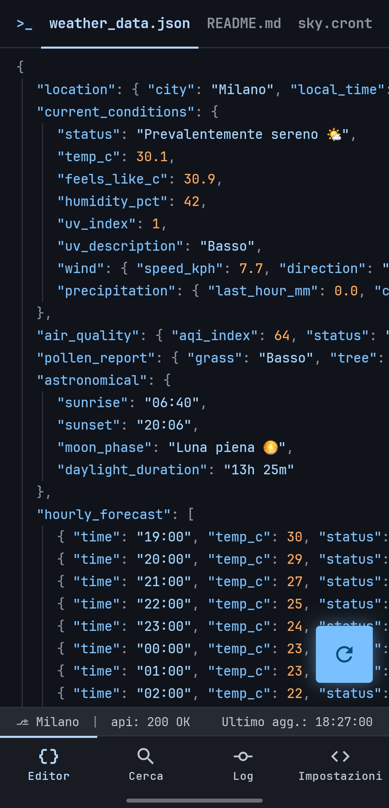 | 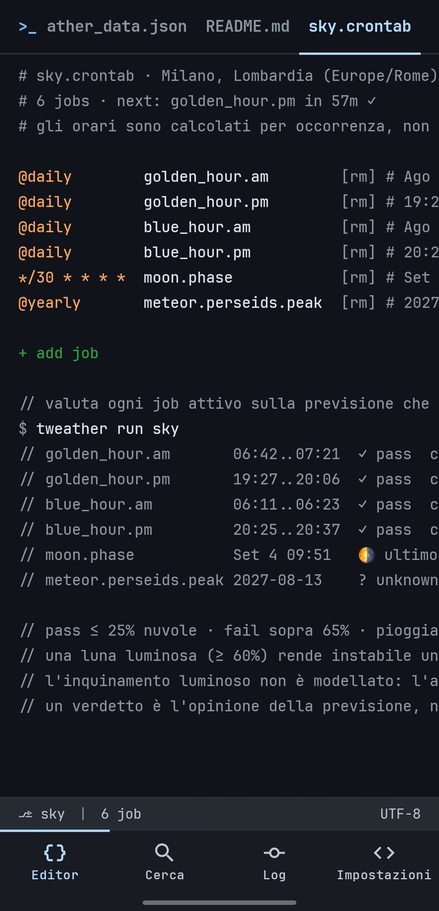 | 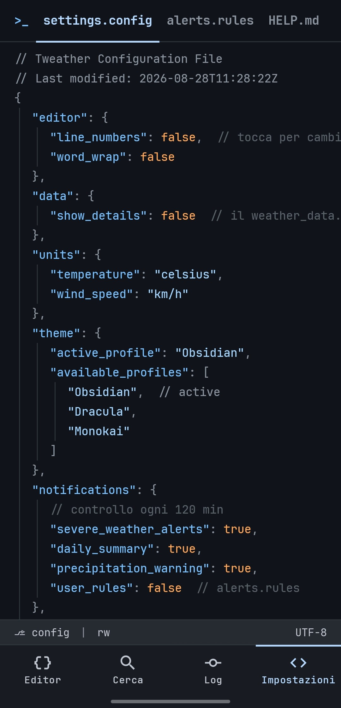 |

---

## The idea

Four tabs at the bottom, ten files behind them. Three of those tabs carry two extra
files on an editor tab bar, in the place an editor would put them: the JSON has the
city's `README.md` and `sky.crontab` next to it, the settings have `alerts.rules` and
`HELP.md`, the log has `forecast.diff` and `sky_runs.log`. The active file is
remembered per screen, the way a workspace remembers the last file you had open.

### `weather_data.json`: the forecast

Tap the FAB to re-run the request. The `//` comments are the loading and error
channel, so a failure reads like a compiler message instead of a toast.

```json
{
  "location": { "city": "Milano", "local_time": "2026-08-29 18:27" },
  "current_conditions": {
    "status": "Mostly clear 🌤️",
    "temp_c": 30.1,
    "feels_like_c": 30.9,
    "humidity_pct": 42,
    "uv_index": 1,
    "wind": { "speed_kph": 7.7, "direction": "SW" },
    "precipitation": { "last_hour_mm": 0.0, "chance_pct": 0 }
  },
  "air_quality": { "aqi_index": 64, "status": "Moderate 🟡" },
  "pollen_report": { "grass": "Low", "tree": "Low" },
  "astronomical": {
    "sunrise": "06:40", "sunset": "20:06",
    "moon_phase": "Full Moon 🌕",
    "daylight_duration": "13h 25m"
  }
}
```

Switch to Fahrenheit and the **keys change too**, to `temp_f` and `speed_mph`. A JSON
file should not lie about its units.

### `README.md`: the city at a glance

In a real repository the README is the human summary of the machine-readable content,
so here it is the second tab of the editor: the same weather, written out as prose and
tables instead of a data structure.

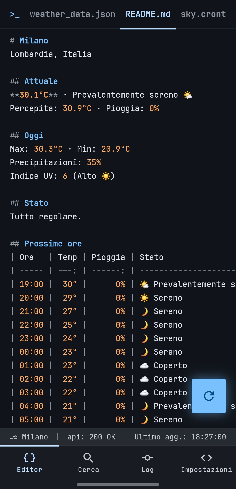

It is shown as markdown **source** with syntax highlighting, GitHub's "Code" view
rather than its Preview. A rendered preview would have to abandon JetBrains Mono, the
4px grid and the gutter, which is to say everything the app is. Being source is also
why the tables are padded into real columns: an unaligned pipe table is simply badly
formatted markdown, and straightening it is the same job as lining up the `=` in a
config file.

```markdown
# Milan
Lombardy, Italy

## Next hours
| Hour  | Temp | Rain | Status           |
| ----- | ---: | ---: | ---------------- |
| 08:00 |  22° |   0% | 🌤️ Mainly Clear  |
| 09:00 |  24° |   0% | 🌤️ Mainly Clear  |
| 10:00 |  25° |   0% | ⛅ Partly Cloudy |
```

Exactly one emoji sits against the left edge of each cell, with the description right
after it. None of the twelve weather emoji exist in JetBrains Mono, so every one of
them is drawn by the system font at roughly two character cells: pinning one per cell
makes that unknown width the same constant on every row, so every description starts
at the same offset and the closing pipe stays in column whatever the device draws.
The status column comes last in both tables for the same reason you put the noisy
field at the end of a log line: the numbers stay on screen, and when a long Italian
description outgrows the display it clips without hiding anything ("Temporale con
grand" still reads as hail). The emoji leads precisely so the sky survives the clip.

Fourteen hours, starting from the hour after the current one. The hour you are in is
already covered by `## Current`, rain probability included on its feels-like line, so
repeating it as the first row would say the same thing twice; and fourteen means a
morning glance reaches the evening (open the app at 08:00 and the table runs to
22:00). A second full dump of all twenty-four hours would erase the difference
between the two tabs. The whole page is translated, headings included. That is not a
contradiction of the keys-stay-English rule below, because this file is prose, not
code.

### `cities.json`: search and saved cities

The input field *is* the `"search_term"` value, quotes included, with a blinking
underscore for a cursor. Geocoding results appear as you type and land in
`"saved_cities"`, the array of cities as fake filenames.

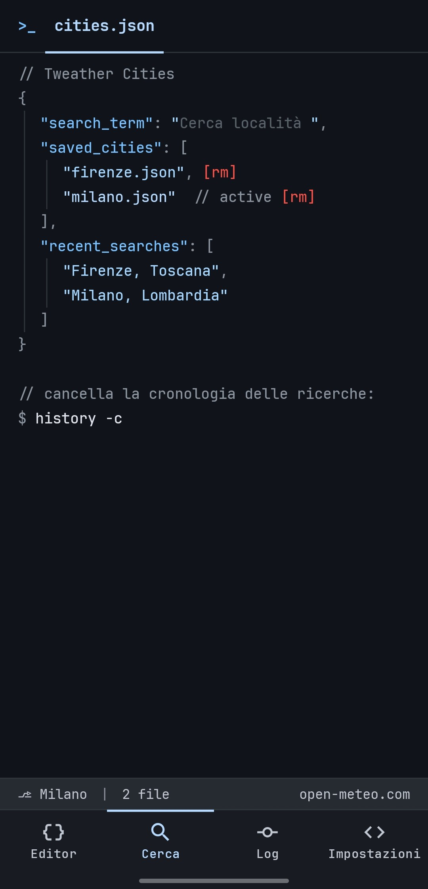

```json
{
  "search_term": "Cerca località ",
  "saved_cities": [
    "firenze.json",           [rm]
    "milano.json"   // active [rm]
  ],
  "recent_searches": [ "Firenze, Toscana", "Milano, Lombardia" ]
}
```

Tapping an entry activates it. `$ history -c` clears the recent searches and nothing
else: that is the shell's own verb, and its narrowness is the point. It forgets what
you searched for, it never touches the cities you saved.

The editor's status bar shows `⎇ <city>`, and it is tappable, exactly like the branch
switcher in VS Code. That is how you get here.

### `settings.config`: the settings

Booleans flip on tap, strings and numbers cycle, and the trailing hint tells you the
allowed values. Resetting is a command with a two-tap confirm:
`$ git restore settings.config`.


### `alerts.rules`: Weather CI

Every fetch is already a commit. Rules are the pipeline that runs on each one, and a
notification is a failed check.

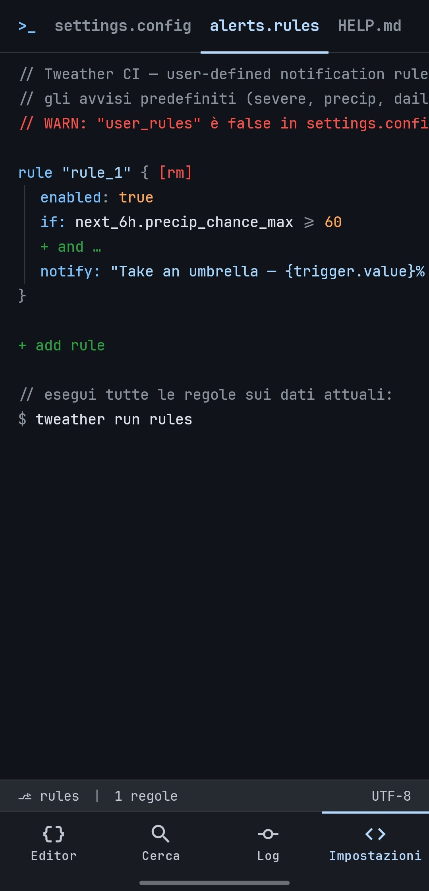

```
rule "rule_1" {   [rm]
  enabled: true
  if:  next_6h.precip_chance_max  >=  60
  + and …
  notify: "Take an umbrella — {trigger.value}% rain at {trigger.time}"
}

+ add rule

// run all rules against current data:
$ tweather run rules
```

There is no parser, and no text field to type a rule into. A rule *looks* like code but
*is* a structure, edited one token at a time: tap the variable and an IDE-style
autocomplete opens as a list of lines, tap the operator and it cycles through
`> >= < <= == !=`, tap the threshold and it becomes a terminal input. A syntax error is
not something you can physically write, so there are no diagnostics to show and no
error state to handle.

The variables are a curated set of 22, named after the fields of `weather_data.json`,
with the time window built into the name. `current.*` is now, `next_6h.*` and
`next_12h.*` are precomputed aggregates over the hourly forecast, `today.*` comes from
the daily one. A bare `rain_probability` would be ambiguous (right now, or tonight?),
and ambiguity in a notification system produces either noise or silences nobody can
explain. Thresholds are stored in metric and rendered in your units, name included:
`current.temp_c` becomes `current.temp_f` when you switch, because a file does not lie
about its units here either.

One `and` per rule, no `or` and no parentheses. Real rules are almost always
conjunctions, and `or` is two rules, a form the file already offers.

`$ tweather run rules` is a dry run, with the usual two-tap confirm. It evaluates
everything against the current data and prints the verdict inline, `// ✓ pass` or
`// ✗ notify: "…"`, without sending anything or touching any state. Rules that fire for
real are deduplicated: the `current.*` ones are edge-triggered and re-arm when the
condition goes false again, the forecast ones fire once per half-day.

Evaluation rides the fetch the alerts already schedule, so the whole feature costs no
extra battery: no new job, no extra request, no extra wakeup.

### `HELP.md`: the in-app guide

The third file behind the Settings tab. It explains what the four tabs are, what the
borrowed words mean (commit, diff, branch, CI), where the data comes from and why the
app looks the way it does. Written for someone who does not read `git` for a living,
and fully localized. A one-off `// new here? open HELP.md` line at the top of the
editor points at it once and goes away as soon as the file has been opened.

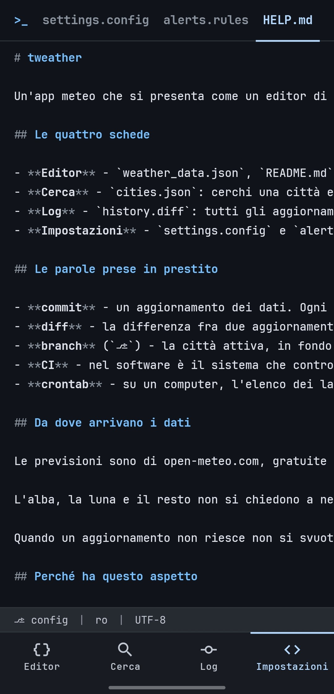

### `sky.crontab`: what the sky has scheduled

`weather_data.json` says what the atmosphere is doing now. `sky.crontab` says what the
sky above the same city has scheduled next, and whether the clouds will let it happen.

The sky is the only scheduler that has never missed a run: the sun rises, the moon
turns, a meteor shower peaks on a date you could have known ten years ahead. So the
file is a crontab. Every job carries a build verdict from the forecast the app already
has.


```
# sky.crontab · Milano, Lombardia (Europe/Rome)
# 6 jobs · next: golden_hour.pm in 57m ✓

@daily   golden_hour.am       [rm]  # Ago …
@daily   golden_hour.pm       [rm]  # 19:27..20:06   ✓ pass  cloud …
@daily   blue_hour.am         [rm]  # Ago …
@daily   blue_hour.pm         [rm]  # 20:25..20:37   ✓ pass  cloud …
*/30 * * * *   moon.phase      [rm]  # Set 4 09:51   🌕 …
@yearly  meteor.perseids.peak [rm]  # 2027-08-13   ? unknown

// pass ≤ 25% cloud · fail above 65% · rain ≥ 70% fails it whatever the sky does
// a verdict is the forecast's opinion, not an observation; it will change
```

A crontab line asserts a fixed schedule, and sunrise is not fixed: it drifts a minute a
day and jumps an hour at the daylight saving boundary. Real crontabs already solved
this. Somebody who has to run a job at a computed moment writes a recurrence and lets
the job work the moment out, documenting the resolved value in a comment. So the cron
field states the recurrence, which is true, and the instant lives in the comment
channel, where a crontab puts computed facts. Every expression the app renders parses
under a real cron parser: that is a unit test, not a promise.

The schedule is computed on the device from your latitude, so it is right in airplane
mode and right past the seven day forecast horizon. The verdicts are not: past where
the forecast ends the file says `? unknown` and why, and it never guesses. Nothing
about light pollution is modelled, because there is no free source worth trusting and
inventing a number would be the app lying. The file says that too, every time you open
it.

Edited by tapping, like `alerts.rules`: the job name comments the line out (which is
how everyone disables a cron job), `[rm]` takes it out of the file, `+ add job` adds one
back from the catalog. `$ tweather run sky` lines every enabled job up under itself.

A line can also tell you before its time. Set `notify_default` in `settings.config` and
every line grows a `--notify` token you can cycle per job: `off · 15m · 30m · 1h · 3h ·
1d`. The reminder carries the verdict and the number behind it, so it says whether it is
worth going out rather than only that something is about to happen, and one for a sky
that will not cooperate is held back unless you ask for it. Fifteen minutes is the
shortest lead on offer because the reminder is approximate by a few minutes: an exact
one would cost battery all day, and a sunset is not an alarm clock. Nothing is sent
until you ask for it, and only ever for the active city.

### `sky_runs.log`: what the sky actually did

The third file in the log. Not a `.diff`, because it records outcomes rather than
changes, and calling it a diff would be the same kind of lie the crontab avoided.

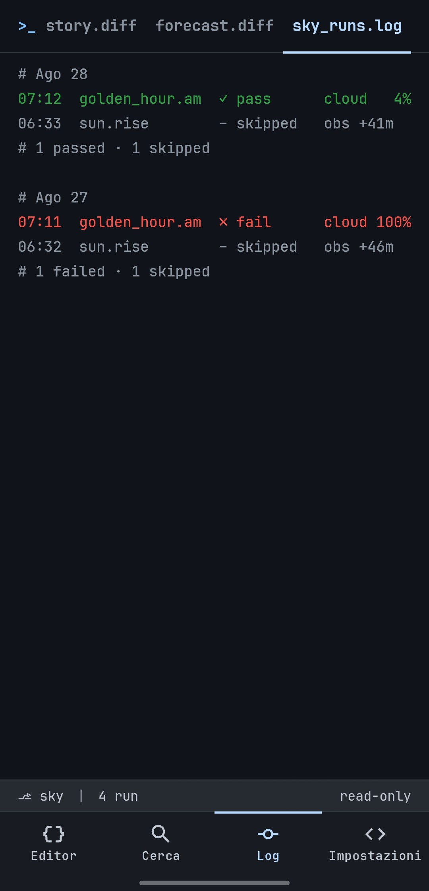

```
# Ago 28
07:12  golden_hour.am   ✓ pass       cloud   4%  obs +41m
06:33  sun.rise         – skipped              obs +41m
# 1 passed · 1 skipped

# Ago 27
07:11  golden_hour.am   ✗ fail       cloud 100%  obs +46m
06:32  sun.rise         – skipped              obs +46m
# 1 failed · 1 skipped
```

`obs` is how far the observing fetch was from the event. It is printed because a
verdict resolved from a reading ninety minutes away is a weaker claim than one from a
reading five minutes away, and hiding that distance would be dishonest. When no fetch
came near enough at all, the run is recorded as skipped and no verdict is invented: it
counts in no statistic.

### `history.diff`: the update log

Every fetch is committed. The diff is computed between consecutive snapshots of the
same city, so you can see exactly what moved and when. A rule that fired on that data
appears as a check line on its commit.

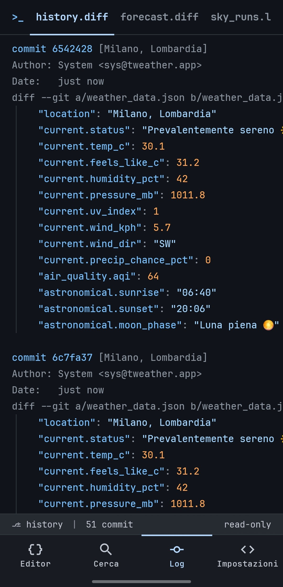

```diff
commit 6542428 [Milano, Lombardia]
Author: System <sys@tweather.app>
Date:   just now
diff --git a/weather_data.json b/weather_data.json
   "location": "Milano, Lombardia"
   "current.status": "Prevalentemente sereno 🌤️"
   "current.temp_c": 30.1
   "current.feels_like_c": 31.2
   "current.humidity_pct": 42
   "current.pressure_mb": 1011.8
```

### `forecast.diff`: how the forecast changed

The second file in the log answers a different question. `history.diff` diffs
*observations*, one moment against the moment before. This one diffs *predictions* for
the same future day: how much has tomorrow changed since the app last looked?

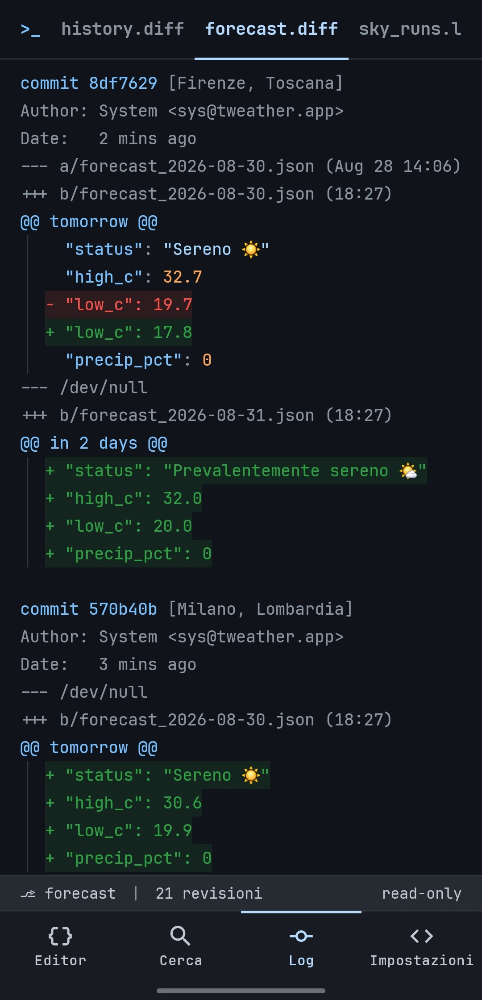

```diff
commit 8df7629 [Firenze, Toscana]
Author: System <sys@tweather.app>
Date:   2 mins ago
--- a/forecast_2026-08-30.json (Aug 28 14:06)
+++ b/forecast_2026-08-30.json (18:27)
@@ tomorrow @@
   "status": "Sereno ☀️"
   "high_c": 32.7
-  "low_c": 19.7
+  "low_c": 17.8
   "precip_pct": 0
```

The horizon is tomorrow and the day after, because day six always changes and nobody
is watching it. Wind is left out as noise. Below 1°C or 10 points of probability
nothing is written at all, and a fetch that moves nothing produces no commit here.

The baseline is the last prediction actually *shown*, not the last one fetched, so a
drift that stays under the threshold accumulates until it crosses it instead of
vanishing one silent step at a time. A day appearing for the first time is a new file,
`--- /dev/null` and all `+` lines. A day falling out of the horizon is simply silence:
it is not a revision.

One fetch is one commit that touches both files, and it carries the same hash in both,
the way a commit does in git.

---

## The widget

A terminal window on the home screen. It re-lays itself out as you resize: from a
glanceable strip up to the full transcript, one extra reading per line of room.

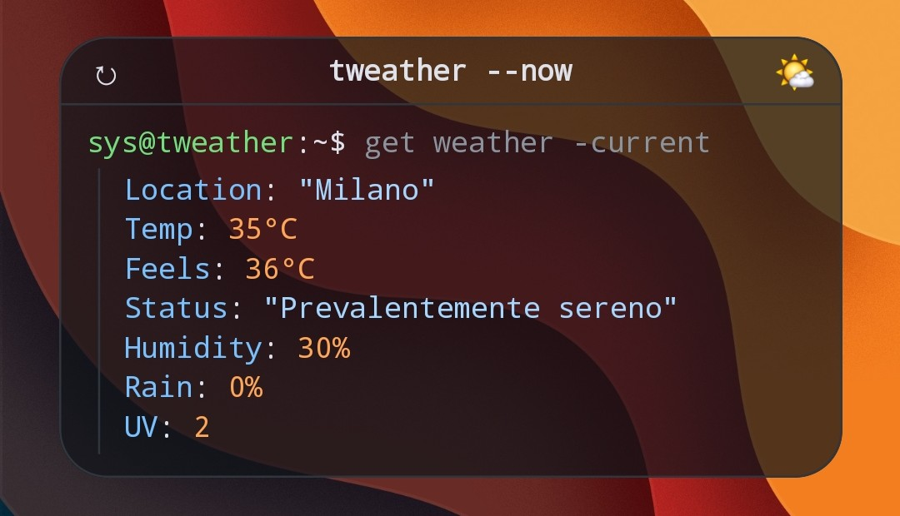

It never polls on its own. It repaints when a fetch commits new data, riding the same
background job the alerts already use, so adding the widget costs no extra battery
beyond what notifications already spend. If a sync fails and the data goes stale, it
says so (`# stale`) instead of presenting old numbers as current.

You can pin a widget to a specific city, or leave it following whatever the app is
showing. Background opacity is configurable. Its configuration screen is a file too,
`widget.config`, reached from the launcher rather than from a tab.

---

## Data

[Open-Meteo](https://open-meteo.com/): free, **no API key, no account**.

| What | Source |
| --- | --- |
| Current, hourly, daily, sunrise/sunset | Forecast API |
| AQI, pollutants, pollen *(Europe only)* | Air Quality API |
| City search | Geocoding API |
| Sun, moon, twilight, meteor showers | computed locally, since the API does not provide them |

Location is optional and **coarse only** (`ACCESS_COARSE_LOCATION`): city-level accuracy
is all a forecast needs. There is no background location: the alert worker uses the
last position you acquired while the app was open, and nothing else.

When an update fails, the files do not go blank. The editor shows the last fetch that
worked and says so before printing a number: what time it is from and how old it is,
in each file's own register (a sentence in `README.md`, `// stale: last good fetch 3h
ago` in the JSON). The hours and days that have already passed are dropped first, so
what is left is what that fetch always said about the time ahead: a response carries a
week of forecast, which is why yesterday's is still worth reading today. Past that
horizon nothing in it is about the present any more, and the app says only that.


---

## Install

Download the APK from the [latest release](https://github.com/fiorenzobrioni/tweather/releases/latest)
and open it on the phone (Android 13 or newer). Android warns before installing
anything from outside a store: expected, since this comes from GitHub. Every release is
signed with the project's release key, so each version installs over the previous one
without losing your cities or settings.

Changes per version are in the [changelog](CHANGELOG.md).

---

## Build

Requires JDK 21. No signing setup, no API key, no local properties: clone and build.

```bash
./gradlew :app:assembleDebug        # app/build/outputs/apk/debug/app-debug.apk
./gradlew :app:testDebugUnitTest    # 598 unit tests, JVM only (Robolectric)
./gradlew :app:lintDebug
```

The release build is minified and shrunk by R8, and **unsigned by default**. To get an
installable one for testing:

```bash
./gradlew :app:assembleRelease -PsignReleaseWithDebugKey
```

That flag signs it with the debug keystore committed in `keystore/`. The keystore is in
the repo on purpose, so debug builds from CI and from any machine share one signature
and can update an existing install. It is not a release key, and the opt-in flag
exists so a store artifact can never be produced with it by accident.

CI runs the tests and lint **before** the builds, so a red suite never produces an
installable artifact. Every push uploads the debug APK, the release APK and the R8
mapping.

Published releases are a separate workflow: a `v*` tag builds the APK signed with the
real release key (kept outside the repo, injected through GitHub Secrets) and publishes
it as a GitHub Release together with the R8 mapping for that exact build.

---

## Architecture

Kotlin 2.2, Jetpack Compose with Material 3, single module, no DI framework.

The first run asks where you are (your position, a city search, or skip) via
`$ tweather init`. Skipping lands on an editor that says `// no location configured`
and offers the search.

| Concern | Choice |
| --- | --- |
| Dependency injection | a hand-rolled `ServiceLocator`, the app being small enough that Hilt would cost more than it saves |
| Settings, cities, search history, rules | DataStore |
| Update history | Room, pruned to the last 100 commits |
| Background work | one WorkManager periodic job shared by the alerts, the rules and the widget, network-constrained, no flex window |
| Alerts and rules | pure engines in `domain/`, no clock and no Android, run on the report the fetch just produced |
| Networking | Retrofit + OkHttp + kotlinx.serialization |

`PLANNING.md` is the phased implementation log: every decision, and every deviation
from the original design, is recorded there with the reason.

---

## Design

The theme is **Obsidian Syntax**, with the full token set in `obsidian_syntax/DESIGN.md`.
Dracula and Monokai ship as alternate profiles, switchable at runtime.

| | |
| --- | --- |
| Keys | `#79c0ff` |
| Strings | `#a5d6ff` |
| Numbers, booleans | `#ffa657` |
| Comments, punctuation | `#8b949e` |
| Additions / deletions | `#2ea043` / `#f85149` |
| Background | `#10141a` |

JetBrains Mono everywhere, a 4px baseline grid, 20px per nesting level, and no drop
shadows: depth comes from 1px borders instead. The one exception is the home widget: since
CVE-2021-0567 the launcher refuses to load font resources into a widget layout, so it
falls back to the system monospace. The badges above are tinted with the same palette.

English and Italian, following the system per-app language, split by register rather
than by punctuation. Code stays code everywhere: the JSON keys, the file names, the `$`
commands, the git headers, the verdicts, the error codes, and `sky.crontab`'s aligned
column of evidence. Anything written to be understood speaks your language (the comment
lines included), and the marker in front of them never moves: an error reads
`// ERROR: permesso negato — il gps resta spento`. `git status` on an Italian phone
says "Sul branch main" and keeps the word `branch`, and so do the logs here. The
screenshots on this page were taken in Italian, which is what that split looks like on a
device.

---

## License

[GPL-3.0](LICENSE) © 2026 Fiorenzo Brioni

Weather data by [Open-Meteo](https://open-meteo.com/) (CC BY 4.0).
[JetBrains Mono](https://www.jetbrains.com/lp/mono/) under the SIL Open Font License.
