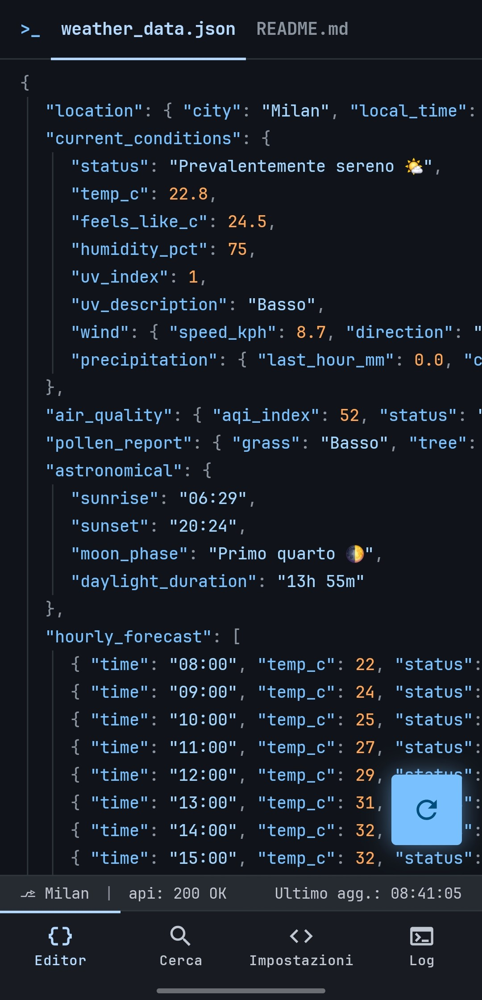
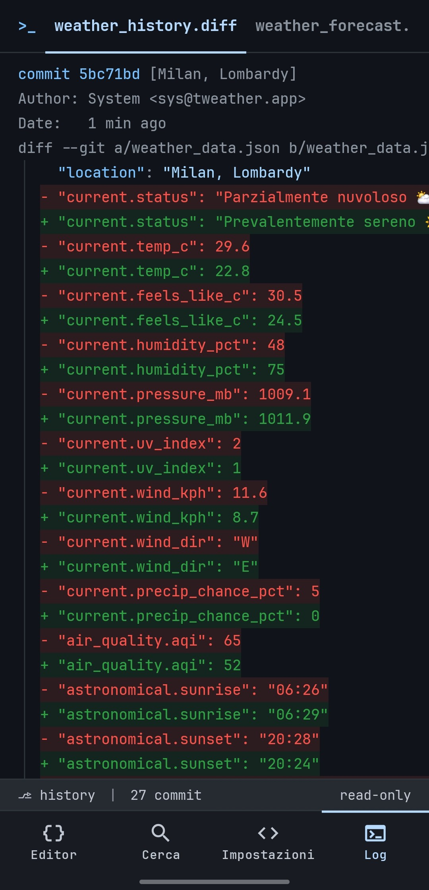
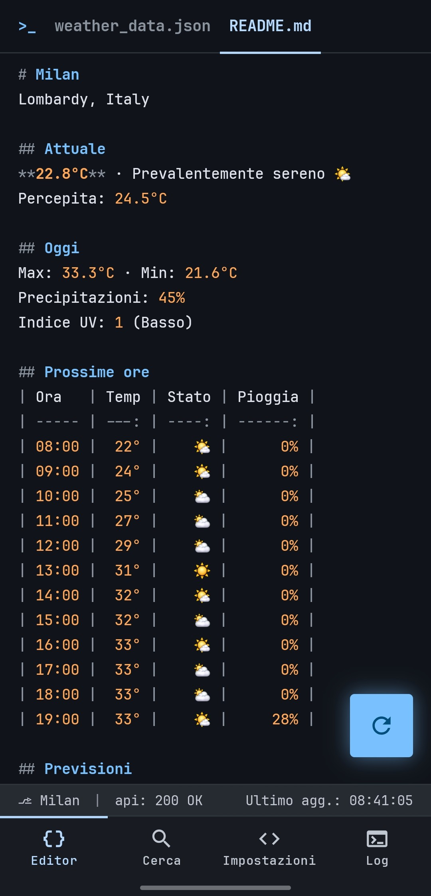
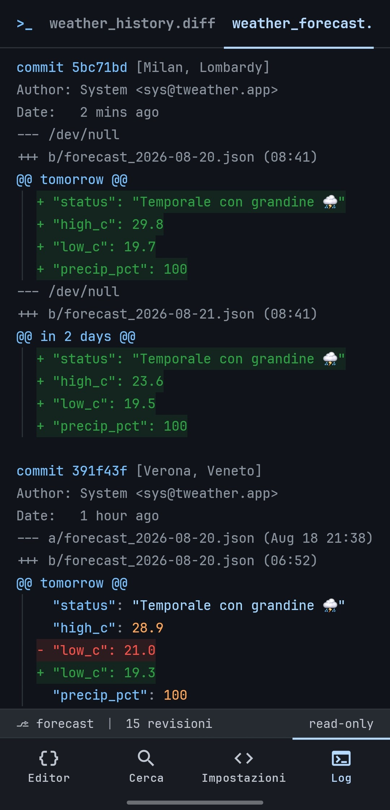

# tweather

[](https://github.com/fiorenzobrioni/tweather/actions/workflows/android-ci.yml)


**A weather app that thinks it is a code editor.**

Every screen is a file. The forecast is syntax-highlighted JSON with a line-number
gutter, settings are a `.config` you edit by tapping values, and the update history is
a git diff, complete with hash, author and `+`/`-` lines. Booleans flip when you tap
their `true` or `false`, the search box is a shell prompt, and the weather icons are
the emoji sitting inside the JSON.

It is a real weather app underneath: live data, background alerts, notification rules
you write yourself, a home-screen widget. The editor is the interface, not a skin over
a list of cards.

| `weather_data.json` | `weather_history.diff` | `settings.config` |
|:---:|:---:|:---:|
|  |  |  |

---

## The idea

Four tabs at the bottom, seven files behind them. Three of those tabs carry a second
file on an editor tab bar, in the place an editor would put it: the JSON has the city's
`README.md` next to it, the settings have `alerts.rules`, the log has a second diff.
The active file is remembered per screen, the way a workspace remembers the last file
you had open.

### `weather_data.json`: the forecast

Tap the FAB to re-run the request. The `//` comments are the loading and error
channel, so a failure reads like a compiler message instead of a toast.

```json
{
  "location": { "city": "Milan", "local_time": "2026-08-19 08:41" },
  "current_conditions": {
    "status": "Mostly clear 🌤️",
    "temp_c": 22.8,
    "feels_like_c": 24.5,
    "humidity_pct": 75,
    "uv_index": 1,
    "wind": { "speed_kph": 8.7, "direction": "E" }
  },
  "air_quality": { "aqi_index": 52, "status": "Moderate 🟡" },
  "astronomical": { "sunrise": "06:29", "sunset": "20:24", "moon_phase": "First Quarter 🌓" }
}
```

Switch to Fahrenheit and the **keys change too**, to `temp_f` and `speed_mph`. A JSON
file should not lie about its units.

### `README.md`: the city at a glance

In a real repository the README is the human summary of the machine-readable content,
so here it is the second tab of the editor: the same weather, written out as prose and
tables instead of a data structure.



It is shown as markdown **source** with syntax highlighting, GitHub's "Code" view
rather than its Preview. A rendered preview would have to abandon JetBrains Mono, the
4px grid and the gutter, which is to say everything the app is. Being source is also
why the tables are padded into real columns: an unaligned pipe table is simply badly
formatted markdown, and straightening it is the same job as lining up the `=` in a
config file.

```markdown
# Milan
Lombardy, Italy

## Next hours
| Hour  | Temp | Status | Rain |
| ----- | ---: | -----: | ---: |
| 08:00 |  22° |     🌤️ |   0% |
| 09:00 |  24° |     🌤️ |   0% |
| 10:00 |  25° |     ⛅ |   0% |
```

Exactly one emoji sits against the right edge of each cell. None of the twelve weather
emoji exist in JetBrains Mono, so every one of them is drawn by the system font at
roughly two character cells: pinning one per cell makes that unknown width the same
constant on every row, and the next pipe stays in column whatever the device draws.

Twelve hours, not twenty-four: that is the horizon the rest of the app works in, and a
second full dump would erase the difference between the two tabs. The whole page is
translated, headings included. That is not a contradiction of the keys-stay-English
rule below, because this file is prose, not code.

### `cities.json`: search and saved cities

The input field *is* the `"search_term"` value, quotes included, with a blinking
underscore for a cursor. Geocoding results appear as you type and land in
`"saved_cities"`, the array of cities as fake filenames.

```json
{
  "search_term": "mil_",
  "saved_cities": [
    "current_location.json",  // gps
    "milan.json",             // active
    "verona.json"                         [rm]
  ],
  "recent_searches": [ "verona", "milan" ]
}
```

Tapping an entry activates it. `$ history -c` clears the recent searches and nothing
else: that is the shell's own verb, and its narrowness is the point. It forgets what
you searched for, it never touches the cities you saved.

The editor's status bar shows `⎇ <city>`, and it is tappable, exactly like the branch
switcher in VS Code. That is how you get here.

### `settings.config`: the settings

Booleans flip on tap, strings and numbers cycle, and the trailing hint tells you the
allowed values. Resetting is a command with a two-tap confirm:
`$ git restore settings.config`.

### `alerts.rules`: Weather CI

Every fetch is already a commit. Rules are the pipeline that runs on each one, and a
notification is a failed check.

```
rule "umbrella" {   [rm]
  enabled: true
  if:  next_6h.precip_chance_max  >=  70
  and: today.high_c  >  25   [rm]
  notify: "Umbrella: {trigger.value}% rain at {trigger.time}"
}

+ add rule

// run all rules against current data:
$ tweather run rules
```

There is no parser, and no text field to type a rule into. A rule *looks* like code but
*is* a structure, edited one token at a time: tap the variable and an IDE-style
autocomplete opens as a list of lines, tap the operator and it cycles through
`> >= < <= == !=`, tap the threshold and it becomes a terminal input. A syntax error is
not something you can physically write, so there are no diagnostics to show and no
error state to handle.

The variables are a curated set of 22, named after the fields of `weather_data.json`,
with the time window built into the name. `current.*` is now, `next_6h.*` and
`next_12h.*` are precomputed aggregates over the hourly forecast, `today.*` comes from
the daily one. A bare `rain_probability` would be ambiguous (right now, or tonight?),
and ambiguity in a notification system produces either noise or silences nobody can
explain. Thresholds are stored in metric and rendered in your units, name included:
`current.temp_c` becomes `current.temp_f` when you switch, because a file does not lie
about its units here either.

One `and` per rule, no `or` and no parentheses. Real rules are almost always
conjunctions, and `or` is two rules, a form the file already offers.

`$ tweather run rules` is a dry run, with the usual two-tap confirm. It evaluates
everything against the current data and prints the verdict inline, `// ✓ pass` or
`// ✗ notify: "…"`, without sending anything or touching any state. Rules that fire for
real are deduplicated: the `current.*` ones are edge-triggered and re-arm when the
condition goes false again, the forecast ones fire once per half-day.

Evaluation rides the fetch the alerts already schedule, so the whole feature costs no
extra battery: no new job, no extra request, no extra wakeup.

### `weather_history.diff`: the update log

Every fetch is committed. The diff is computed between consecutive snapshots of the
same city, so you can see exactly what moved and when. A rule that fired on that data
appears as a check line on its commit.

```diff
commit 5bc71bd [Milan, Lombardy]
Author: System <sys@tweather.app>
Date:   1 min ago
✓ rule "umbrella" fired
diff --git a/weather_data.json b/weather_data.json
   "location": "Milan, Lombardy"
-  "current.temp_c": 29.6
+  "current.temp_c": 22.8
-  "current.humidity_pct": 48
+  "current.humidity_pct": 75
```

### `weather_forecast.diff`: how the forecast changed

The second file in the log answers a different question. `weather_history.diff` diffs
*observations*, one moment against the moment before. This one diffs *predictions* for
the same future day: how much has tomorrow changed since the app last looked?



```diff
commit 391f43f [Verona, Veneto]
Author: System <sys@tweather.app>
Date:   1 hour ago
--- a/forecast_2026-08-20.json (Aug 18 21:38)
+++ b/forecast_2026-08-20.json (06:52)
@@ tomorrow @@
   "status": "Thunderstorm with hail ⛈️"
   "high_c": 28.9
-  "low_c": 21.0
+  "low_c": 19.3
   "precip_pct": 100
```

The horizon is tomorrow and the day after, because day six always changes and nobody
is watching it. Wind is left out as noise. Below 1°C or 10 points of probability
nothing is written at all, and a fetch that moves nothing produces no commit here.

The baseline is the last prediction actually *shown*, not the last one fetched, so a
drift that stays under the threshold accumulates until it crosses it instead of
vanishing one silent step at a time. A day appearing for the first time is a new file,
`--- /dev/null` and all `+` lines. A day falling out of the horizon is simply silence:
it is not a revision.

One fetch is one commit that touches both files, and it carries the same hash in both,
the way a commit does in git.

---

## The widget

A terminal window on the home screen. It re-lays itself out as you resize: from a
glanceable strip up to the full transcript, one extra reading per line of room.


It never polls on its own. It repaints when a fetch commits new data, riding the same
background job the alerts already use, so adding the widget costs no extra battery
beyond what notifications already spend. If a sync fails and the data goes stale, it
says so (`# stale`) instead of presenting old numbers as current.

You can pin a widget to a specific city, or leave it following whatever the app is
showing. Background opacity is configurable. Its configuration screen is a file too,
`widget.config`, reached from the launcher rather than from a tab.

---

## Data

[Open-Meteo](https://open-meteo.com/): free, **no API key, no account**.

| What | Source |
| --- | --- |
| Current, hourly, daily, sunrise/sunset | Forecast API |
| AQI, pollutants, pollen *(Europe only)* | Air Quality API |
| City search | Geocoding API |
| Moon phase | computed locally, since the API does not provide it |

Location is optional and **coarse only** (`ACCESS_COARSE_LOCATION`): city-level accuracy
is all a forecast needs. There is no background location: the alert worker uses the
last position you acquired while the app was open, and nothing else.

---

## Build

Requires JDK 21. No signing setup, no API key, no local properties: clone and build.

```bash
./gradlew :app:assembleDebug        # app/build/outputs/apk/debug/app-debug.apk
./gradlew :app:testDebugUnitTest    # 317 unit tests, JVM only (Robolectric)
./gradlew :app:lintDebug
```

The release build is minified and shrunk by R8, and **unsigned by default**. To get an
installable one for testing:

```bash
./gradlew :app:assembleRelease -PsignReleaseWithDebugKey
```

That flag signs it with the debug keystore committed in `keystore/`. The keystore is in
the repo on purpose, so debug builds from CI and from any machine share one signature
and can update an existing install. It is not a release key, and the opt-in flag
exists so a store artifact can never be produced with it by accident.

CI runs the tests and lint **before** the builds, so a red suite never produces an
installable artifact. Every push uploads the debug APK, the release APK and the R8
mapping.

---

## Architecture

Kotlin 2.2, Jetpack Compose with Material 3, single module, no DI framework.

| Concern | Choice |
| --- | --- |
| Dependency injection | a hand-rolled `ServiceLocator`, the app being small enough that Hilt would cost more than it saves |
| Settings, cities, search history, rules | DataStore |
| Update history | Room, pruned to the last 100 commits |
| Background work | one WorkManager periodic job shared by the alerts, the rules and the widget, network-constrained, no flex window |
| Alerts and rules | pure engines in `domain/`, no clock and no Android, run on the report the fetch just produced |
| Networking | Retrofit + OkHttp + kotlinx.serialization |

`PLANNING.md` is the phased implementation log: every decision, and every deviation
from the original design, is recorded there with the reason.

---

## Design

The theme is **Obsidian Syntax**, with the full token set in `obsidian_syntax/DESIGN.md`.
Dracula and Monokai ship as alternate profiles, switchable at runtime.

| | |
| --- | --- |
| Keys | `#79c0ff` |
| Strings | `#a5d6ff` |
| Numbers, booleans | `#ffa657` |
| Comments, punctuation | `#8b949e` |
| Additions / deletions | `#2ea043` / `#f85149` |
| Background | `#10141a` |

JetBrains Mono everywhere, a 4px baseline grid, 20px per nesting level, and no drop
shadows: depth comes from 1px borders instead. The one exception is the home widget: since
CVE-2021-0567 the launcher refuses to load font resources into a widget layout, so it
falls back to the system monospace. The badges above are tinted with the same palette.

English and Italian, following the system per-app language. The rule is that "code"
stays English (JSON keys, filenames, `//` comments, git headers, terminal output) while
the chrome and the weather *values* are translated. The screenshots on this page were
taken in Italian, which is what that split looks like on a device.

---

## License

[GPL-3.0](LICENSE) © 2026 Fiorenzo Brioni

Weather data by [Open-Meteo](https://open-meteo.com/) (CC BY 4.0).
[JetBrains Mono](https://www.jetbrains.com/lp/mono/) under the SIL Open Font License.
